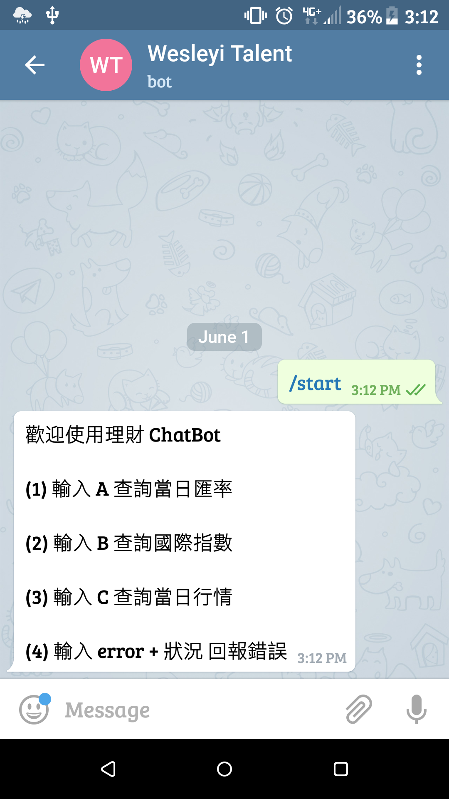
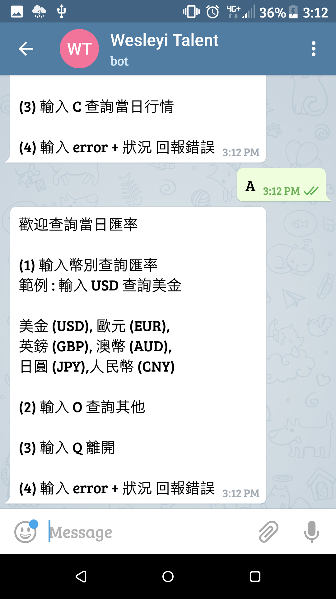
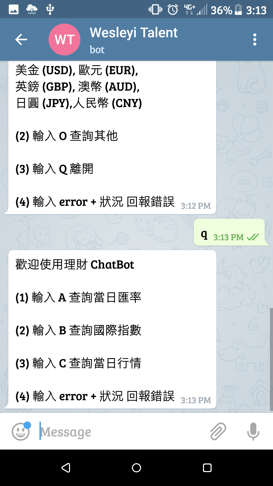
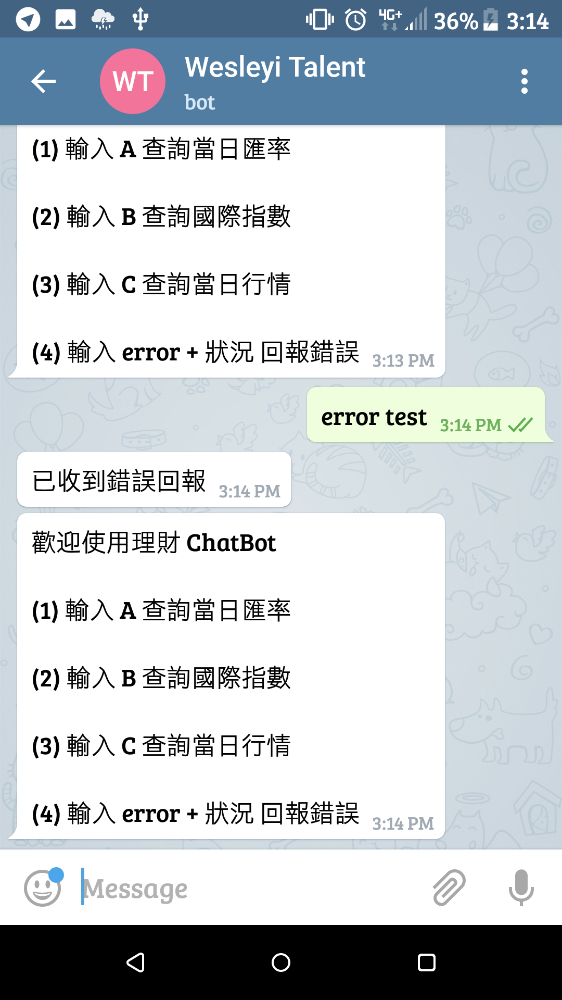
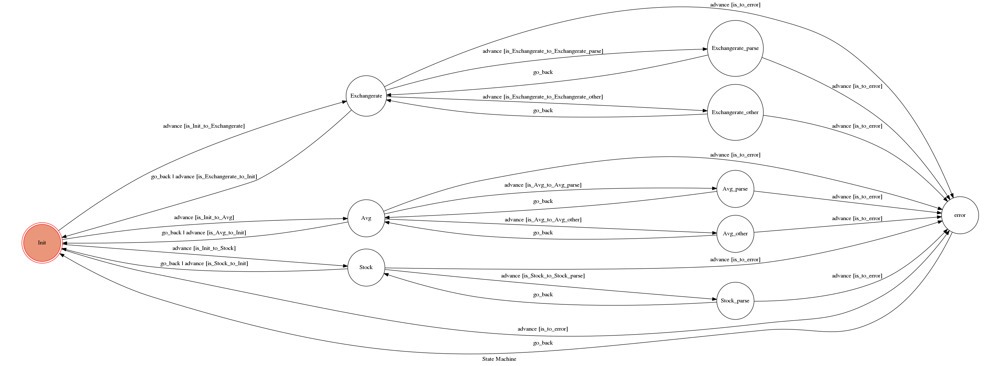

# TOC Project 2017

- TOC Project 2017

- A telegram bot based on a finite state machine

- You can lookup 當日匯率(exchange rate), 國際指數(stock market index), 當日行情(stock market)

## Setup

### Prerequisite

- Python 3

### Install Dependency

- use `make` to install dependency

or

```sh
pip3 install -r requirements.txt
```

* pygraphviz (For visualizing Finite State Machine)
    * [Setup pygraphviz on Ubuntu](http://www.jianshu.com/p/a3da7ecc5303)

### Secret Data
- API_TOKEN

   - The current `API_TOKEN` is for @Wesleyi_Talent_bot (https://telegram.me/Wesleyi_Talent_bot)
   
   - Set `API_TOKEN` at `app.py` line 13
   
- WEBHOOK_URL

   - `WEBHOOK_URL` will be automatically set when running `app.py`
   
   - If the previous function is not work, please set `WEBHOOK_URL`  at `app.py` line 166

## Server

- use `make run` to start `ngrok` and `app.py`

   - After run `./ngrok http 5000` in another terminal
   
      - `ngrok` is downloaded from https://ngrok.com/download

   - The original terminal will `sleep 5` (5 sec) for waiting the connection

   - If 5 sec is not enough, please increase the sleeping time in `Makefile` 

   - `app.py` can automatically parse `http://127.0.0.1:4040` and set `WEBHOOK_URL`

## Client

- Add @Wesleyi_Talent_bot (https://telegram.me/Wesleyi_Talent_bot)

- Push `start` to talk with chat bot

   

- you can lookup 當日匯率(exchange rate), 國際指數(stock market index), 當日行情(stock market) by following the instruction (case insensitive)

## Demonstration
### e.g. 1
Enter `A` for 當日匯率

   


### e.g. 2
Enter `Q` for 離開

   


### e.g. 3
Enter `error`+error message for 錯誤回報

    

server:

   

## Finite State Machine



## Functions
* Basic function

   * more than three transactions departing from the initial state
   
   * more than three states in sequential order

   * Display FSM
   
      * visit (WEBHOOK_URL)/show-fsm
   * ...

* Dynamic data

   * parsing the up to date data

* Users can report error messages, which would be saved at `error.log` later

* parse `http://127.0.0.1:4040` and set `WEBHOOK_URL`

   * you don't need to change `WEBHOOK_URL` everytime
   
* Add Makefile

   * `make` to install dependency 
   
   * use `make run` to start `ngrok` and `app.py`
